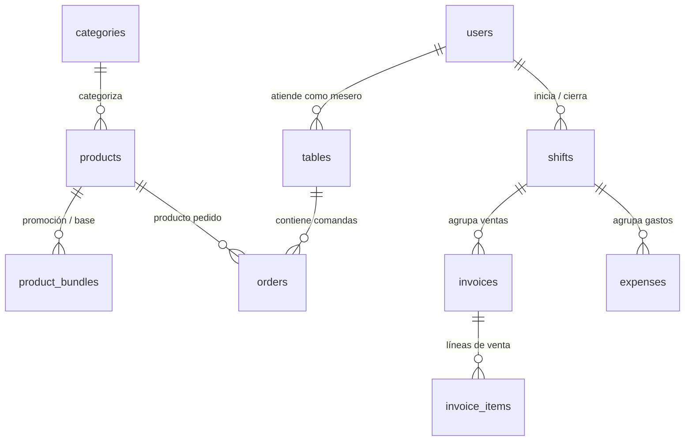

# Supabase Database Expert — Zorix POS (`Demo_Bar_v1.0`)

Esta skill define el rol de asistente especializado en la base de datos PostgreSQL alojada en **Supabase** para el proyecto **Zorix POS**. Contiene la documentación técnica actualizada del esquema, relaciones, funciones RPC, índices B-Tree, reglas de consumo y diagnóstico de infraestructura.

---

## 1. Información General del Proyecto y Entorno

* **Proyecto Activo:** `Zorix POS` (`Demo_Bar_v1.0`)
* **Ref de Proyecto Supabase:** `lbdrmastjmxlaqaxpqcv`
* **Endpoint API REST / PostgREST:** `https://lbdrmastjmxlaqaxpqcv.supabase.co/rest/v1/`
* **Motor de Base de Datos:** PostgreSQL 15+ administrado por Supabase
* **Protocolos de Acceso:** 
  * API REST / PostgREST via `@supabase/supabase-js` (`v2.112.2`)
  * Suscripciones en tiempo real (**Supabase Realtime Channel**: `pos-realtime-channel`)
* **Variables de Entorno Clave:**
  * `VITE_SUPABASE_URL`: Endpoint activo de la API
  * `VITE_SUPABASE_ANON_KEY`: Llave pública anónima para el cliente web

---

## 2. Esquema Completo de Tablas y Relaciones



### 2.1. `users` (Usuarios y Autenticación de Turno)
Gestiona el personal con acceso al sistema (cajeros, meseros, administradores).
* `id` (`uuid`, PK): Identificador único autogenerado.
* `name` (`text`): Nombre legible del empleado (ej. "Juan Pérez").
* `username` (`text`, Unique): Usuario de acceso para el panel de administración.
* `password_hash` (`text`): Contraseña o PIN rápido de 6 dígitos.
* `role` (`text`): Rol de acceso (`admin`, `cajero`, `mesero`).
* `is_active` (`boolean`, default `true`): Estado de activación del usuario.

### 2.2. `categories` (Categorías de Productos)
* `id` (`text`, PK): Código de categoría (ej. `cervezas`, `licores`, `comida`, `bebidas`, `cigarros`).
* `name` (`text`): Nombre para mostrar en el catálogo.
* `icon` (`text`, nullable): Nombre del icono de Lucide/React Icons.

### 2.3. `products` (Catálogo de Productos)
* `id` (`uuid`, PK): ID del producto.
* `name` (`text`): Nombre comercial (ej. `TOÑA 12 ONZA`, `ALITAS DE 6`).
* `category_id` (`text`, FK -> `categories.id`): Categoría a la que pertenece.
* `price` (`numeric(10,2)`): Precio de venta al público en Córdobas (C$).
* `cost` (`numeric(10,2)`, default `0`): Costo unitario para cálculo de ganancias brutas.
* `stock` (`integer`, nullable): *Regla:* En Zorix POS, la propiedad `stock` se mantiene siempre en `null`. No hay restricción de existencias ni descuento estricto de inventario en caja.
* `icon_path` (`text`, nullable): URL de la imagen en Supabase Storage (bucket `products/product_images/`).
* `is_active` (`boolean`, default `true`): Visibilidad en el menú.

### 2.4. `product_bundles` (Combos y Promociones)
Establece la relación entre promociones/combos y sus productos base para efectos de costo y reportes.
* `id` (`uuid` / `serial`, PK): Identificador del registro.
* `promotion_id` (`uuid`, FK -> `products.id`): El producto tipo combo que se cobra.
* `base_product_id` (`uuid`, FK -> `products.id`): El producto individual componente.
* `quantity_to_deduct` (`numeric`): Cuántas unidades del producto base corresponden.

### 2.5. `tables` (Mesas y Cuentas Activas en Tiempo Real)
Representa las cuentas abiertas actualmente en el local o en barra.
* `id` (`text`, PK): Identificador único. Convención:
  * Mesas de salón: `mesa_<timestamp>` (ej. `mesa_1789326117411`).
  * Cuentas de barra: `barra_<timestamp>` (ej. `barra_1789326048343`).
* `name` (`text`): Nombre visual asignado (ej. `Mesa 3`, `Barra`).
* `area` (`text`, default `'Rancho principal'`): Área o zona asignada (ej. `Rancho principal`, `Rancho 2`, `Piscina 1`, `Piscina 2`, `Piscina 3`).
* `status` (`text`): Estado operativo (`libre`, `ocupada`, `pendiente_pago`).
  * *Regla:* Al cobrarse una mesa (`payInvoice`), esta **se elimina físicamente** de la tabla `tables` para mantener la base de datos limpia y de alta velocidad.
* `customer_name` (`text`): Nombre del cliente asignado.
* `assigned_waiter_id` (`uuid`, FK -> `users.id`, nullable): Mesero que atiende.
* `created_at` (`timestamptz`): Fecha y hora de apertura.
* `is_bar_account` (`boolean`, default `false`): Booleano que indica si es cuenta de barra.
* `order_version` (`bigint`, default `0`): Versión secuencial para Control de Concurrencia Optimista (OCC).

### 2.6. `orders` (Comandas y Productos por Mesa)
* `id` (`bigint` / `uuid`, PK): Identificador del ítem en comanda.
* `table_id` (`text`, FK -> `tables.id` con `ON DELETE CASCADE`): Mesa a la que pertenece.
* `product_id` (`uuid`, FK -> `products.id`): Producto ordenado.
* `quantity` (`numeric`): Cantidad ordenada.
* `is_printed` (`boolean`, default `false`): Estado de impresión en comanda física.
* *Restricción Única:* Índice único `(table_id, product_id)` para prevenir líneas duplicadas por producto.

### 2.7. `shifts` (Turnos y Cortes de Caja)
* `id` (`uuid`, PK): Identificador único del turno.
* `opened_at` (`timestamptz`, default `now()`): Inicio del turno.
* `closed_at` (`timestamptz`, nullable): Fin del turno (`null` = turno actualmente abierto).
* `opened_by` (`uuid`, FK -> `users.id`): Cajero/Admin que inició turno.
* `closed_by` (`uuid`, FK -> `users.id`, nullable): Cajero/Admin que cerró el turno.
* `total_expected` (`numeric(12,2)`, nullable): Total de ventas esperadas.
* `total_real` (`numeric(12,2)`, nullable): Monto real entregado en caja física.
* `difference` (`numeric(12,2)`, nullable): Sobrante o faltante.

### 2.8. `invoices` (Facturas Históricas y Cobros)
* `id` (`text`, PK): Número de factura con prefijo `FAC-<timestamp>`.
* `shift_id` (`uuid`, FK -> `shifts.id`): Turno en el que se realizó la venta.
* `table_name` (`text`): Nombre de la mesa o barra cobrada.
* `customer_name` (`text`): Cliente facturado.
* `waiter_name` (`text`): Nombre del mesero que atendió.
* `cashier_name` (`text`): Nombre del cajero que procesó el cobro.
* `total` (`numeric(10,2)`): Total pagado (aplica **10% adicional** si el pago es con `Tarjeta`).
* `payment_method` (`text`): Forma de pago (`Efectivo`, `Tarjeta`, `Transferencia`).
* `transaction_id` (`text`, nullable): Código de referencia de tarjeta/transferencia.
* `created_at` (`timestamptz`, default `now()`): Fecha y hora de emisión.

### 2.9. `invoice_items` (Detalle de Productos Facturados)
* `id` (`uuid`, PK): ID de la línea de factura.
* `invoice_id` (`text`, FK -> `invoices.id` con `ON DELETE CASCADE`): Factura padre.
* `product_name` (`text`): Nombre congelado del producto al momento de venta.
* `quantity` (`numeric`): Cantidad cobrada.
* `price_at_sale` (`numeric(10,2)`): Precio unitario en el momento de la venta.
* `cost_at_sale` (`numeric(10,2)`): Costo unitario en el momento de la venta.

### 2.10. `expenses` (Egresos y Gastos de Turno)
* `id` (`uuid`, PK): Identificador del gasto.
* `shift_id` (`uuid`, FK -> `shifts.id`): Turno que asume el egreso.
* `amount` (`numeric(10,2)`): Monto del gasto en Córdobas.
* `description` (`text`): Concepto o motivo.
* `category` (`text`): Categoría del gasto (`compras`, `servicios`, `mantenimiento`, `otros`).
* `is_paid` (`boolean`, default `true`): Estado de pago.
* `notification_date` (`date`, nullable): Para pagos programados a futuro.
* `created_at` (`timestamptz`, default `now()`): Fecha de registro.

### 2.11. `settings` (Parámetros Globales)
* `key` (`text`, PK): Clave del parámetro (ej. `exchange_rate`).
* `value` (`text`): Valor almacenado (ej. `"36.62"`).

---

## 3. Índices de Rendimiento B-Tree Creados

La base de datos cuenta con 11 índices B-Tree sobre todas las claves foráneas para erradicar escaneos completos (*Sequential Scans*):

```sql
CREATE INDEX idx_orders_table_id ON public.orders (table_id);
CREATE INDEX idx_orders_product_id ON public.orders (product_id);
CREATE INDEX idx_invoices_shift_id ON public.invoices (shift_id);
CREATE INDEX idx_invoice_items_invoice_id ON public.invoice_items (invoice_id);
CREATE INDEX idx_expenses_shift_id ON public.expenses (shift_id);
CREATE INDEX idx_products_category_id ON public.products (category_id);
CREATE INDEX idx_tables_assigned_waiter_id ON public.tables (assigned_waiter_id);
CREATE INDEX idx_product_bundles_promotion_id ON public.product_bundles (promotion_id);
CREATE INDEX idx_product_bundles_base_product_id ON public.product_bundles (base_product_id);
CREATE INDEX idx_shifts_opened_by ON public.shifts (opened_by);
CREATE INDEX idx_shifts_closed_by ON public.shifts (closed_by);
```

---

## 4. Función RPC Transaccional: `save_table_order`

La función almacenada `public.save_table_order` es la encargada de guardar comandas de forma atómica con soporte de **zonas/áreas** y **Control de Concurrencia Optimista (OCC)**:

```sql
CREATE OR REPLACE FUNCTION public.save_table_order(
  p_table_id text,
  p_expected_version bigint,
  p_table jsonb,
  p_items jsonb
)
RETURNS jsonb
LANGUAGE plpgsql
AS $$
declare
  v_table public.tables%rowtype;
begin
  -- 1. Insertar fila de la mesa si no existe, preservando p_table->>'area'
  insert into public.tables (
    id, name, area, status, customer_name, assigned_waiter_id, created_at,
    is_bar_account, order_version
  ) values (
    p_table_id,
    coalesce(p_table->>'name', 'Mesa'),
    coalesce(nullif(p_table->>'area', ''), 'Rancho principal'),
    coalesce(p_table->>'status', 'ocupada'),
    coalesce(p_table->>'customer_name', ''),
    nullif(p_table->>'assigned_waiter_id', '')::uuid,
    coalesce(nullif(p_table->>'created_at', '')::timestamptz, now()),
    coalesce((p_table->>'is_bar_account')::boolean, false),
    0
  ) on conflict (id) do nothing;

  -- 2. Bloqueo exclusivo para evitar carreras entre dispositivos concurrentes
  select * into v_table
  from public.tables
  where id = p_table_id
  for update;

  -- 3. Verificación de versión (Concurrencia Optimista)
  if p_expected_version is null or v_table.order_version <> p_expected_version then
    raise exception 'TABLE_ORDER_CONFLICT'
      using errcode = '40001',
            detail = format('Expected version %s but current version is %s', p_expected_version, v_table.order_version);
  end if;

  -- 4. Actualizar metadata de mesa e incrementar versión
  update public.tables
  set name = coalesce(p_table->>'name', v_table.name),
      area = coalesce(nullif(p_table->>'area', ''), v_table.area, 'Rancho principal'),
      status = coalesce(p_table->>'status', v_table.status),
      customer_name = coalesce(p_table->>'customer_name', v_table.customer_name),
      assigned_waiter_id = coalesce(nullif(p_table->>'assigned_waiter_id', '')::uuid, v_table.assigned_waiter_id),
      is_bar_account = coalesce((p_table->>'is_bar_account')::boolean, v_table.is_bar_account),
      order_version = v_table.order_version + 1
  where id = p_table_id;

  -- 5. Reemplazar comandas de la mesa atómicamente
  delete from public.orders where table_id = p_table_id;

  insert into public.orders (table_id, product_id, quantity, is_printed)
  select
    p_table_id,
    (item->>'product_id')::uuid,
    (item->>'quantity')::numeric,
    coalesce((item->>'is_printed')::boolean, true)
  from jsonb_array_elements(coalesce(p_items, '[]'::jsonb)) as item;

  return jsonb_build_object('order_version', v_table.order_version + 1);
end;
$$;

GRANT EXECUTE ON FUNCTION public.save_table_order(text, bigint, jsonb, jsonb) TO anon, authenticated;
```

---

## 5. Parámetros Críticos de Configuración de PostgreSQL

Para evitar que transacciones abortadas o conexiones huérfanas congelen el pool de PostgREST (`PGRST003: Timed out acquiring connection from connection pool`), PostgreSQL tiene configurado:

```sql
ALTER DATABASE postgres SET idle_in_transaction_session_timeout = '20000';
ALTER ROLE authenticator SET idle_in_transaction_session_timeout = '20000';
```

---

## 6. Buenas Prácticas para Consultas SQL y Consumo PostgREST

1. **Filtrar siempre por `shift_id`:** Las tablas `invoices` y `expenses` acumulan historial. Acotar siempre las lecturas al turno activo (`shift_id`) o emplear carga bajo demanda (`loadShiftHistory`).
2. **Evitar sondeos en bucle (*polling*):** No utilizar `setInterval` en bucle para leer tablas completas. Usar las suscripciones Realtime de Supabase con debouncing (1800 ms) y escucha de reconexión.
3. **Manejo de Zona Horaria:** PostgreSQL almacena en `timestamptz` (UTC). Para los cierres de caja de Nicaragua (UTC-6), un día calendario abarca desde las 06:00 UTC del día hasta las 06:00 UTC del día siguiente.
4. **Política de Inventario en Venta:** Zorix POS no bloquea ni descuenta existencias en bodega durante la venta (`stock: null`).

---

## 7. Protocolo de Diagnóstico de Infraestructura

Si Supabase reporta picos de CPU o ralentizaciones:
1. **Revisar conexiones activas:**
   ```sql
   SELECT pid, usename, state, now() - state_change as duration, left(query, 100)
   FROM pg_stat_activity
   WHERE datname = 'postgres' AND state != 'idle';
   ```
2. **Purgar WAL y buffers tras tormentas de datos:**
   * Ejecutar **Restart Project -> Fast reboot** desde *Project Settings -> General* en la consola de Supabase.
